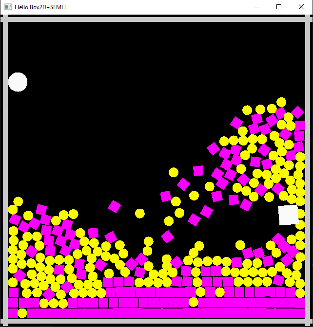

# PhysicsExample
Example of Box2D phyiscs engine interacting with SFML for rendering and I/O.

[Install SFML.Net](https://www.nuget.org/packages/SFML.Net) and [SFML.Net](https://www.nuget.org/packages/Box2DSharp) from Nuget before building the project!

 - Import the code in Visual Studio 
 - Right-click the project from "Solution Explorer"
 - Click "Open in Terminal"
 - Run the command `dotnet add package SFML.Net --version 2.5.0`
 - Run the command `dotnet add package Box2DSharp --version 0.6.0`
 - Build the project!

